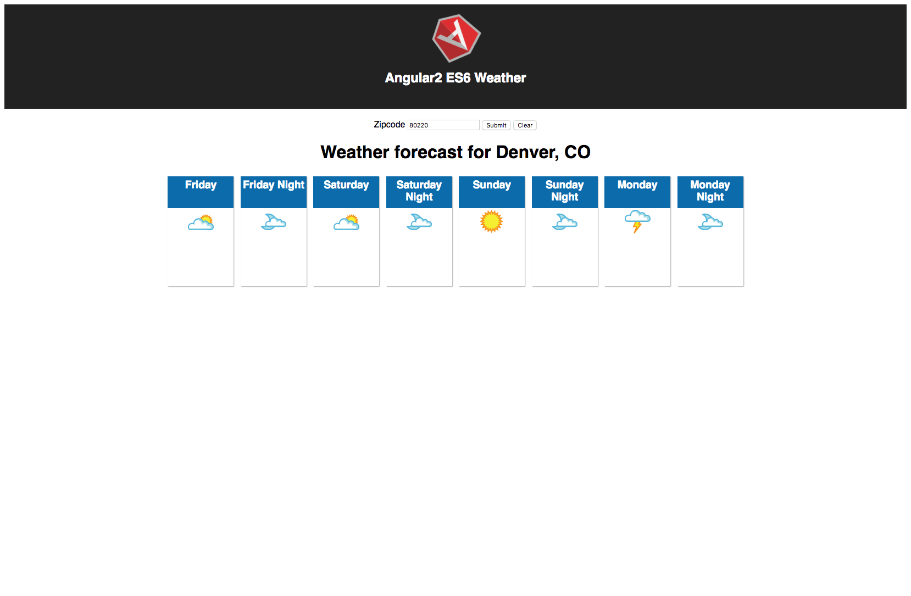

# ng2-es6-weather
Simple weather app built with Angular2 using ES6, no Typescript with similar examples
also available in react and vue

https://github.com/jchull/react-weather

https://github.com/jchull/vue-weather

# Getting Started
First, install the required node packages with npm: 

`npm install`

## Weather Underground API key
You must obtain a free key from //www.wunderground.com/weather/api/

Create a .env.local file, using .env as a template

`npm start`

